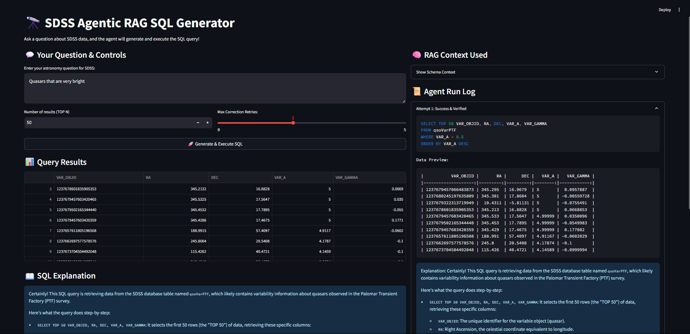

# AstroQueryGPT: SDSS RAG-Powered Astronomy Explorer



## Overview

AstroQueryGPT is a next-generation Streamlit application for exploring astronomical data from the Sloan Digital Sky Survey (SDSS) using natural language. It leverages Retrieval-Augmented Generation (RAG) and Large Language Models (LLMs) to:

- Select the most relevant SDSS tables and fields for your question
- Generate and correct SQL queries automatically
- Execute queries against the SDSS SkyServer
- Visualize and explain results interactively

## Key Features

- **Natural Language Querying:** Ask astronomy questions in plain English
- **RAG-Driven Table Selection:** Finds the best SDSS table(s) and schema context for your query
- **LLM-Powered SQL Generation & Correction:** Generates, explains, and auto-corrects SQL using OpenAI models
- **Automatic Error Handling:** If a query fails, the agent retries with LLM-corrected SQL
- **Data Verification:** Checks if the returned data is relevant and well-structured
- **Interactive Visualization:** View results in a dataframe and as RA vs. Redshift plots (if available)
- **Transparent Agent Log:** See every attempt, error, correction, and LLM explanation

## Quickstart

1. **Install dependencies:**

    ```bash
    pip install -r requirements.txt
    ```

2. **Set up your OpenAI API key:**

    Create a `.env` file in the project root:

    ```env
    OPENAI_API_KEY="your_openai_api_key_here"
    ```

3. **Run the app:**

    ```bash
    streamlit run streamlit_app.py
    ```

    The app will open in your browser (usually at [http://localhost:8501](http://localhost:8501)).

## Usage

- Enter your astronomy question (e.g., "galaxies with redshift > 0.3")
- Choose the number of results (TOP N) and max retries
- Click **Generate & Execute SQL**
- View the generated SQL, results, LLM explanations, and agent log

## How It Works

1. **RAG Retrieval:** Finds the most relevant SDSS tables and fields for your query using semantic search (embeddings)
2. **Prompt Construction:** Builds a detailed prompt with schema context for the LLM
3. **LLM SQL Generation:** LLM generates SQL; if it fails, the error and prior SQL are fed back for correction (agentic loop)
4. **Execution & Verification:** Runs the SQL, verifies data structure, and retries if needed
5. **Explanation:** LLM explains the SQL and checks if it matches your intent

## Project Structure

- `streamlit_app.py` — Main Streamlit UI and agentic workflow
- `rag_core.py` — RAG retrieval, prompt building, and LLM logic
- `sdss_schema_scraper.py` — Script to build the SDSS schema knowledge base
- `sdss_schema_dr16.json` — Local SDSS schema (tables, fields, descriptions)
- `sdss_db.py` or `sdss_api.py` — SQL execution against SDSS SkyServer
- `initialize_client.py` — OpenAI API client setup
- `config.py` — App and agent configuration
- `imgs/` — Demo screenshots

## Example Queries

- galaxies with redshift > 0.3
- stars with magnitude < 15
- quasars with declination > 20
- find galaxies with petrosian radius in r band > 10 arcsec
- show me all objects in AtlasOutline with size > 1000

## Advanced Features

- **Agentic Correction Loop:** If SQL fails, the agent retries with LLM-corrected queries (up to N times)
- **RAG Context Display:** See which tables/fields were used as context for each query
- **LLM Explanations:** Get plain-English explanations of every SQL query
- **Full Agent Log:** Inspect every attempt, error, and correction

## Requirements

- Python 3.8+
- See `requirements.txt` for all dependencies (including `sentence-transformers` for semantic search)

## Contributing

Contributions are welcome! Please open issues or pull requests for new features, bug fixes, or schema improvements.

## License

MIT License

## Attribution

- Code comments in this project were generated using GPT-4.1, So they may or not be completely accurate and faithful on the operations of the actual written code.
